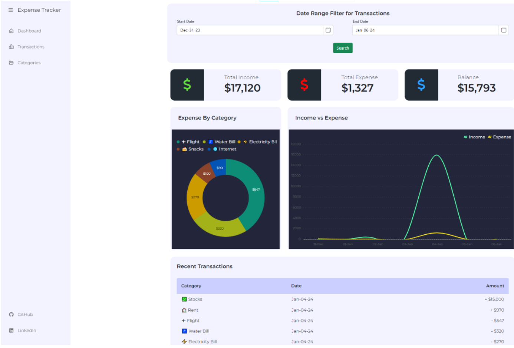
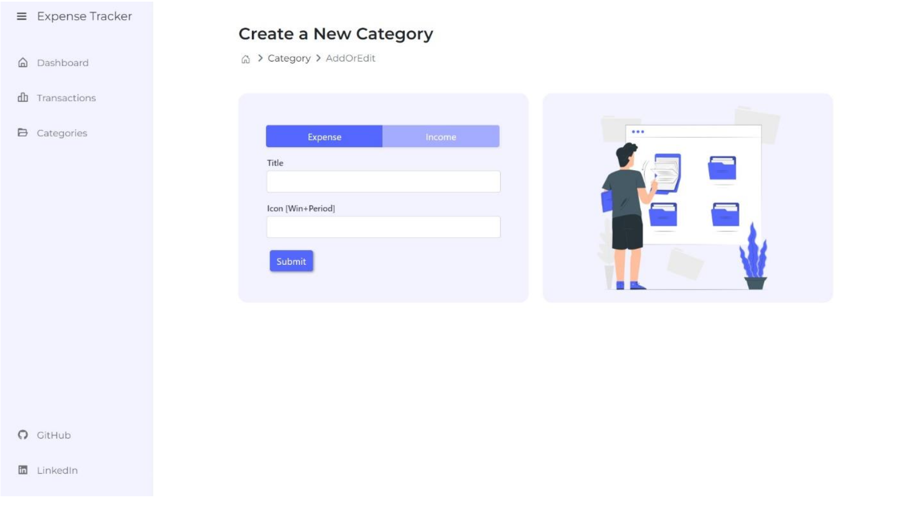

# Expense tracking application

This repository contains the source code for an Expense Management System (EMS) developed using the **ASP.NET MVC** framework. The system aims to streamline expense tracking, approval workflows, and reporting, providing users with an intuitive and efficient platform.

## Features

### User Features:
- **Expense Submission**: Add and manage expenses by category, date, and amount, with the ability to attach receipts for validation.
- **Expense Dashboard**: Visualize expenses through graphs and reports.
- **User Authentication**: Secure login system with role-based access (user/admin).

### Admin Features:
- **Approval Workflows**: Manage and approve expense submissions.
- **Category Management**: Add, edit, and delete expense categories.
- **Reporting Tools**: Generate detailed reports on expenses by category, time period, and user.

### Additional Highlights:
- **Responsive Design**: Optimized for mobile and desktop devices.
- **Integration**: Compatible with financial systems for seamless data exchange.
- **Data Security**: Role-based access control and audit trails for compliance.

## Technologies Used
- **Frontend**: HTML5, CSS3, JavaScript, Bootstrap
- **Backend**: ASP.NET MVC, C#
- **Database**: Microsoft SQL Server
- **ORM**: Entity Framework

### Project Images





### Prerequisites:
- Visual Studio 2022 or later
- Microsoft SQL Server
- .NET Framework 5.0 or later


## Installation
1. Clone the repository:
```bash
   git clone https://github.com/your-username/Expense-Management-System.git
2. Apply the initial migration: 
dotnet ef add migration initialCreate
3. Update the database:
dotnet ef database update
